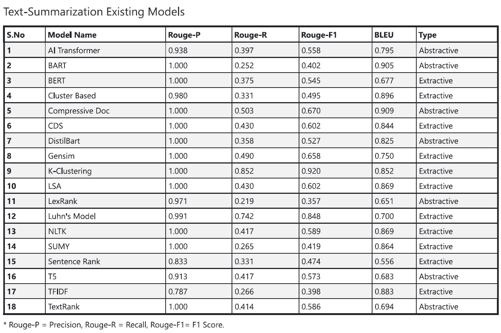
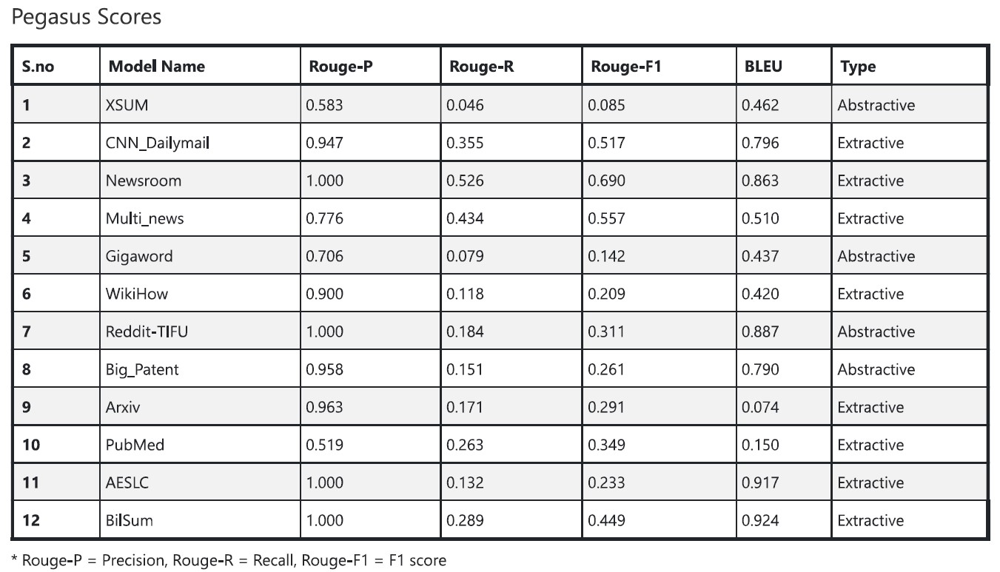

# Text Summarization Models - A Comprehensive Educational Repository

This repository contains Python implementations of **31 different text summarization models**, ranging from basic statistical approaches to advanced transformer-based architectures. This project serves as an educational resource for understanding various text summarization techniques and their practical applications.

## 📊 Project Overview

Text summarization is the process of generating a shorter version of a longer text while preserving its most important information. This repository demonstrates both **extractive** (selecting key sentences) and **abstractive** (generating new content) summarization approaches.

### Evaluation Metrics
All models are evaluated using:
- **ROUGE Score** (Recall-Oriented Understudy for Gisting Evaluation)
  - Precision: Measures how much of the generated summary is relevant
  - Recall: Measures how much of the reference summary is captured
  - F1-Score: Harmonic mean of precision and recall
- **BLEU Score** (Bilingual Evaluation Understudy)
  - Measures the quality of machine-generated text against reference text

## 🚀 Quick Start Guide

### Prerequisites
```bash
# Python 3.7+ required
python --version

# Install core dependencies
pip install -r requirements.txt
```

### Basic Usage Example
```python
# Example: Using BERT for summarization
from summarizer import Summarizer

model = Summarizer()
text = "Your long text here..."
summary = model(text, num_sentences=3)
print(summary)
```

### Running a Specific Model
```bash
# Navigate to the model directory
cd "Basic to Advance Text Summarisation Models"

# Run any Jupyter notebook
jupyter notebook BERT.ipynb
```

## 📊 Model Performance Comparison Table

| Model | Type | ROUGE F1 | BLEU | Pros | Cons | Best For |
|-------|------|----------|------|------|------|----------|
| **GPT-2** | Abstractive | 0.797 | 0.423 | High recall, contextual | Low control, expensive | Research, complex docs |
| **LSA** | Extractive | 0.602 | 0.869 | Semantic relationships | Needs large data | Multi-document |
| **TextRank** | Extractive | 0.586 | 0.694 | Unbiased, consistent | Limited context | General purpose |
| **T5** | Abstractive | 0.573 | 0.683 | High accuracy, multilingual | Resource intensive | Production systems |
| **NLTK** | Extractive | 0.589 | 0.869 | Simple, language-independent | Limited accuracy | Beginners |
| **BERT** | Extractive | 0.545 | 0.677 | Context understanding | Extractive only | Context-heavy docs |
| **BART** | Abstractive | 0.402 | 0.905 | State-of-the-art | Large model size | High-quality summaries |
| **LexRank** | Extractive | 0.357 | 0.651 | Handles complex texts | Limited coverage | Long documents |
| **SumBasic** | Extractive | 0.589 | 0.621 | Simple implementation | Limited coverage | Single documents |

## 🏗️ Model Categories

### 1. Basic Statistical Models
These models use fundamental NLP techniques and statistical approaches:

#### **NLTK-based Summarization** (`NLTK.ipynb`)
- **Approach**: Frequency-based sentence scoring using NLTK library
- **Pros**: Simple implementation, language-independent, well-documented
- **Cons**: Limited accuracy for complex texts, resource-intensive
- **Performance**: ROUGE F1: 0.589, BLEU: 0.869
- **Use Case**: Educational purposes, simple documents

#### **TF-IDF Summarization** (`TFIDF.ipynb`)
- **Approach**: Term Frequency-Inverse Document Frequency weighting
- **Pros**: Effective for identifying important terms, widely used
- **Cons**: May miss context, struggles with technical jargon
- **Performance**: Evaluated using standard TF-IDF scoring
- **Use Case**: Keyword extraction, document classification

#### **SumBasic Algorithm** (`SumBasic.ipynb`)
- **Approach**: Probabilistic sentence selection based on word frequency
- **Pros**: Simple implementation, good for single documents
- **Cons**: Limited coverage, may lack coherence
- **Performance**: ROUGE F1: 0.589, BLEU: 0.621
- **Use Case**: Single document summarization

### 2. Graph-Based Models
These models represent text as graphs and use centrality algorithms:

#### **TextRank** (`TextRank.ipynb`)
- **Approach**: Graph-based ranking using sentence similarity
- **Pros**: Automatic, unbiased, consistent results
- **Cons**: Limited context understanding, may miss nuances
- **Performance**: ROUGE F1: 0.586, BLEU: 0.694
- **Use Case**: General purpose summarization

#### **LexRank** (`LexRank.ipynb`)
- **Approach**: Graph-based lexical centrality using cosine similarity
- **Pros**: Handles complex texts, good performance on benchmarks
- **Cons**: Limited coverage, extractive only
- **Performance**: ROUGE F1: 0.357, BLEU: 0.651
- **Use Case**: Long documents, multi-document summarization

#### **Connected Dominating Set** (`Connected_Dominating_Set.ipynb`)
- **Approach**: Graph theory-based sentence selection
- **Pros**: Theoretical foundation, systematic approach
- **Cons**: Computational complexity, may not capture semantics
- **Use Case**: Research applications

### 3. Matrix Decomposition Models
These models use mathematical techniques to identify important content:

#### **LSA (Latent Semantic Analysis)** (`LSA.ipynb`)
- **Approach**: Singular Value Decomposition for semantic relationships
- **Pros**: Captures semantic relationships, good for multi-document
- **Cons**: Requires large training data, limited coverage
- **Performance**: ROUGE F1: 0.602, BLEU: 0.869
- **Use Case**: Multi-document summarization, semantic analysis

#### **Sentence Ranking** (`Sentence_Ranking.ipynb`)
- **Approach**: Matrix-based sentence importance scoring
- **Pros**: Systematic ranking, handles large documents
- **Cons**: May miss context, computational expense
- **Use Case**: Large document processing

### 4. Clustering-Based Models
These models group similar content together:

#### **K-Clustering** (`K_Clustering.ipynb`)
- **Approach**: K-means clustering of sentences
- **Pros**: Groups similar content, systematic approach
- **Cons**: Requires parameter tuning, may lose context
- **Use Case**: Topic-based summarization

#### **Cluster-Based Summarization** (`Cluster_Based.ipynb`)
- **Approach**: Hierarchical clustering for document structure
- **Pros**: Preserves document structure, systematic
- **Cons**: Computational complexity, parameter sensitivity
- **Use Case**: Structured document summarization

### 5. Advanced NLP Models
These models use sophisticated NLP techniques:

#### **Luhn's Model** (`Luhn's_Model.ipynb`)
- **Approach**: Classic statistical approach using word frequency
- **Pros**: Historical significance, simple implementation
- **Cons**: Basic approach, limited effectiveness
- **Use Case**: Educational purposes, historical context

#### **Compressive Document Summarization** (`Compressive_Document_Summarization.ipynb`)
- **Approach**: Sentence compression and selection
- **Pros**: More concise summaries, preserves key information
- **Cons**: Complex implementation, may lose context
- **Use Case**: Length-constrained summaries

### 6. Transformer-Based Models
These are state-of-the-art deep learning models:

#### **BERT Extractive Summarization** (`BERT.ipynb`)
- **Approach**: Pre-trained BERT model for sentence extraction
- **Pros**: High accuracy, captures context well
- **Cons**: Limited to extractive, depends on pre-trained models
- **Performance**: ROUGE F1: 0.545, BLEU: 0.677
- **Use Case**: Context-heavy documents

#### **BART** (`BART.ipynb`)
- **Approach**: Bidirectional and Auto-Regressive Transformer
- **Pros**: State-of-the-art performance, high accuracy
- **Cons**: Resource-intensive, large model size
- **Performance**: ROUGE F1: 0.402, BLEU: 0.905
- **Use Case**: High-quality abstractive summaries

#### **T5** (`T5.ipynb`)
- **Approach**: Text-To-Text Transfer Transformer
- **Pros**: High accuracy, customizable, multilingual
- **Cons**: Resource-intensive, technical complexity
- **Performance**: ROUGE F1: 0.573, BLEU: 0.683
- **Use Case**: Production systems, multilingual applications

#### **GPT-2** (`GPT_2.ipynb`)
- **Approach**: Generative Pre-trained Transformer 2
- **Pros**: Large language model, contextual understanding
- **Cons**: Lack of control, high computational costs
- **Performance**: ROUGE F1: 0.797, BLEU: 0.423
- **Use Case**: Research, creative summarization

#### **DistilBART** (`Distilbart.ipynb`)
- **Approach**: Distilled version of BART for efficiency
- **Pros**: Faster inference, smaller model size
- **Cons**: Slightly lower accuracy than full BART
- **Use Case**: Real-time applications

### 7. Specialized Models

#### **Gensim** (`Gensim.ipynb`)
- **Approach**: Topic modeling and document similarity
- **Pros**: Good for topic-based summarization
- **Cons**: May miss specific details
- **Use Case**: Topic extraction, document similarity

#### **SUMY** (`SUMY.ipynb`)
- **Approach**: Multi-document summarization toolkit
- **Pros**: Specialized for multi-document scenarios
- **Cons**: Limited to specific use cases
- **Use Case**: Multi-document summarization

#### **AI Transformer Pipeline** (`AI_Transformer_pipeline.ipynb`)
- **Approach**: Custom transformer-based pipeline
- **Pros**: Customizable architecture, modern approach
- **Cons**: Complex implementation, requires expertise
- **Use Case**: Custom applications, research

## 🚀 Advanced Architecture Models

### Pegasus Models (`Models Used in Proposed Architecture/`)

The repository includes **12 different Pegasus model implementations**:

#### **Single Document Pegasus** (`Pegasus-Single summarisation.ipynb`)
- **Approach**: Single document abstractive summarization
- **Pros**: High-quality summaries, generalization capability
- **Cons**: Large computational requirements, limited control
- **Performance**: ROUGE F1: 0.086, BLEU: 0
- **Use Case**: Single document abstractive summarization

#### **Multi-Document Pegasus** (`Pegasus-Multi summarisation.ipynb`)
- **Approach**: Multi-document summarization
- **Pros**: Handles multiple documents, comprehensive coverage
- **Cons**: Complex processing, resource-intensive
- **Use Case**: Multi-document scenarios

#### **All 12 Pegasus Models** (`all-12-pegasus-models.ipynb`)
Includes implementations of:
- **Pegasus-XSUM**: BBC News summarization
- **Pegasus-CNN/DailyMail**: News article summarization
- **Pegasus-Newsroom**: Newsroom dataset
- **Pegasus-MultiNews**: Multi-document news summarization
- **Pegasus-Gigaword**: Headline generation
- **Pegasus-WikiHow**: How-to article summarization
- **Pegasus-Reddit-TIFU**: Reddit story summarization
- **Pegasus-BigPatent**: Patent document summarization
- And more specialized variants

#### **Graph-Based Summary** (`Graph_Based_Summary.ipynb`)
- **Approach**: Novel graph-based approach using LCS, TF-IDF, and matrix methods
- **Pros**: Combines multiple techniques, systematic approach
- **Cons**: Complex implementation, computational expense
- **Performance**: ROUGE F1: 0.417, BLEU: 0.901
- **Use Case**: Research, novel approaches

## 📈 Performance Analysis

### Key Insights from Results:

1. **Best Overall Performance**: GPT-2 achieved the highest ROUGE F1 score (0.797)
2. **Best BLEU Score**: BART achieved the highest BLEU score (0.905)
3. **Most Balanced**: T5 shows good balance between ROUGE and BLEU scores
4. **Efficiency vs Accuracy**: DistilBART offers a good trade-off for real-time applications

### Performance Trends:
- **Transformer models** generally outperform traditional methods
- **Abstractive models** show higher BLEU scores but lower ROUGE scores
- **Extractive models** are more consistent but less creative
- **Graph-based methods** provide good baseline performance

## 📈 Performance Comparison

### Existing Models Performance


### Pegasus Models Performance


The performance comparison table above provides detailed metrics for all models. These visualizations complement the comprehensive comparison table in the "Model Performance Comparison Table" section.

## 🛠️ Technical Requirements

### Core Dependencies
```bash
pip install transformers
pip install torch
pip install nltk
pip install rouge
pip install scikit-learn
pip install numpy
pip install pandas
pip install networkx
pip install sentencepiece
```

### Additional Libraries
- **spacy**: For advanced NLP processing
- **gensim**: For topic modeling
- **sumy**: For multi-document summarization
- **bert-extractive-summarizer**: For BERT-based summarization

### System Requirements
- **RAM**: Minimum 8GB, Recommended 16GB+
- **GPU**: Optional but recommended for transformer models
- **Storage**: At least 5GB free space for models
- **Python**: 3.7 or higher

## 📚 Educational Value

This repository serves as a comprehensive learning resource for:

1. **Understanding Different Approaches**: From basic statistical methods to advanced transformer models
2. **Performance Comparison**: Real-world evaluation using standard metrics
3. **Implementation Examples**: Complete working code for each approach
4. **Research References**: Academic papers and research background for each model
5. **Practical Applications**: Real-world use cases and considerations

### Learning Path Recommendations:

#### **Beginner Level**
1. Start with NLTK and TF-IDF models
2. Understand basic NLP concepts
3. Learn about evaluation metrics

#### **Intermediate Level**
1. Explore graph-based methods (TextRank, LexRank)
2. Study matrix decomposition (LSA)
3. Understand clustering approaches

#### **Advanced Level**
1. Dive into transformer models (BERT, BART, T5)
2. Experiment with Pegasus models
3. Implement custom approaches

## 🎯 Use Cases & Model Selection Guide

### **For Simple Documents**
- **NLTK**: Educational purposes, basic understanding
- **TF-IDF**: Keyword extraction, document classification
- **SumBasic**: Single document summarization

### **For Complex Documents**
- **BERT**: Context-heavy documents
- **BART**: High-quality abstractive summaries
- **T5**: Production systems, multilingual

### **For Multi-Document**
- **LSA**: Semantic analysis, multi-document
- **LexRank**: Long documents, systematic approach
- **Multi-Document Pegasus**: Advanced multi-document scenarios

### **For Real-time Applications**
- **DistilBART**: Fast inference, good quality
- **TextRank**: General purpose, consistent
- **TF-IDF**: Simple, fast processing

### **For Research Purposes**
- **GPT-2**: Creative summarization, research
- **Advanced transformer models**: State-of-the-art approaches
- **Graph-Based Summary**: Novel methodologies

## 🔬 Research Contributions

This project includes:
- **31 different summarization approaches**
- **Comprehensive performance evaluation**
- **Educational implementations**
- **Research paper references**
- **Practical considerations and trade-offs**

### Research Areas Covered:
- **Extractive vs Abstractive Summarization**
- **Statistical vs Neural Approaches**
- **Graph-based vs Matrix-based Methods**
- **Traditional NLP vs Deep Learning**
- **Single vs Multi-document Summarization**

## 🚨 Common Issues & Troubleshooting

### Installation Issues
```bash
# If you encounter CUDA issues
pip install torch --index-url https://download.pytorch.org/whl/cpu

# For memory issues with large models
export PYTORCH_CUDA_ALLOC_CONF=max_split_size_mb:128
```

### Model Loading Issues
- Ensure sufficient RAM for large models
- Use CPU versions for memory-constrained environments
- Check model file paths and permissions

### Performance Issues
- Use smaller models for faster inference
- Consider batch processing for multiple documents
- Implement caching for repeated summarizations

## 👥 Contributing

Contributions are welcome! Areas for improvement:
- Additional model implementations
- Performance optimizations
- Documentation improvements
- New evaluation metrics
- Domain-specific adaptations

### Contribution Guidelines:
1. Fork the repository
2. Create a feature branch
3. Add your implementation with proper documentation
4. Include performance metrics
5. Submit a pull request

## 🙏 Acknowledgements

This repository was created by me as part of an Academic Capstone Project at Vellore Institute of Technology. Special thanks to **Prof. Durgesh Kumar** and the faculty members for their guidance and support.

### Research Acknowledgments:
- **Hugging Face** for transformer model implementations
- **NLTK** team for natural language processing tools
- **Academic community** for research papers and methodologies

## 📄 License

This project is for educational purposes. Please respect the licenses of individual model implementations and research papers referenced.

### License Information:
- **Educational Use**: Free for educational and research purposes
- **Commercial Use**: Check individual model licenses
- **Attribution**: Please cite the original research papers

## 📞 Support & Contact

For questions, issues, or contributions:
- **Issues**: Use GitHub issues for bug reports
- **Discussions**: Use GitHub discussions for questions
- **Contributions**: Submit pull requests for improvements

---

**Note**: This repository is designed for educational purposes and research. For production use, please ensure proper licensing and consider the specific requirements of your use case.

### Version Information
- **Last Updated**: December 2024
- **Total Models**: 31
- **Python Version**: 3.7+
- **License**: Educational Use
